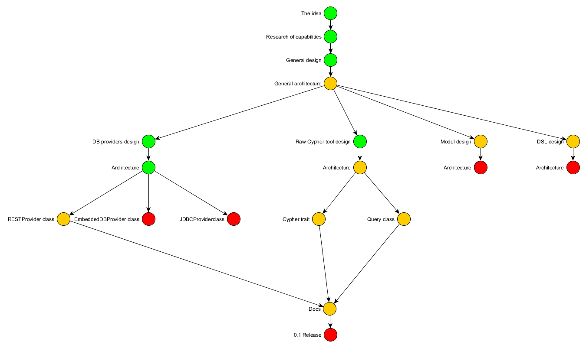

<html>
  <head><meta content="text/html; charset=windows-1251"></head>
  <body lang=ENG>
    
 
      

      
      

    

    
 
      The <b>Glint</b> is a <a href="http://neo4j.com">Neo4j</a> ORM library for <a href="http://www.scala-lang.org">Scala</a>, which represent Neo4j nodes and relationships as a Scala objects and provide DSL for work with him. Glint is purely OOP library, i.e. you not need use Cypher in your code. 
    

    

    
 
      

      <b>Road map:</b> 
    

    
 
        
    

    </body>
</html>